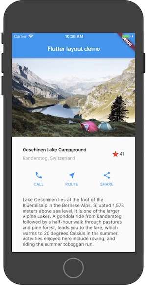
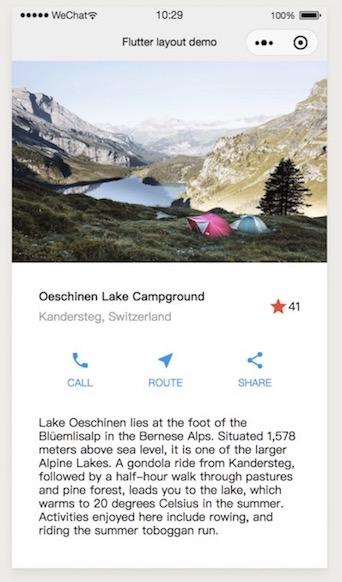

Google Flutter是一个非常优秀的跨端框架，不仅可以运行在Android、 iOS平台，而且可以支持Web和桌面应用。在国内小程序是非常重要的技术平台，我们也一直思考能否把Flutter扩展到小程序端？我们团队之前已经开源了Alita项目，Alita可以把React Native的代码转换并运行在微信小程序平台。受此启发，我们认为同样是声明式UI框架的Flutter同样可以运行在小程序平台。 

所以，我们发起了flutter_mp开源项目（https://github.com/areslabs/flutter_mp）。以微信小程序为例，不过现阶段，flutter_mp项目还处于早期的实验阶段，很多功能还在探索规划中，欢迎大家在Github上随时关注我们的最新进展，或者参与项目共同探索。                                            
# 原理简介
虽然还有诸多功能未完成，我们先来谈谈整个**flutter_mp**的实现原理。篇幅原因，下面我们将只对**flutter_mp**几个重要的部分进行简单说明。 

先看下flutter_mp的实际效果：

                                 


Flutter版官方layout样例

                             


通过flutter_mp转换并运行在小程序端效果
## 声明式UI的处理
**Flutter**是声明式UI框架，声明式UI只需要向框架描述UI长什么样子而不用关心框架具体的实现细节，具体到**Flutter**，上层的UI描述使用底层的skia图形引擎处理就是原生**Flutter**，而把底层处理换成html/css/canvas就是**flutter_web**，**flutter_mp**则是探索在类小程序上对这些UI描述的处理。 

我们看一个最简单例子

```
var x = 'Hello World'

Center(
     child: Text(x)
);
```
对于上面的UI结构，我们只需要在小程序的wxml文件里，用如下的结构对应就OK了。 

```
// wxml部分
<Center>
   <Text>{{x}}</Text>
</Center>

// js 部分
Component({
   data: {
       x: 'Hello World'
   }
}) 
```

虽然实际的结构要比上面的情况复杂的多，不过通过上面简单的例子，我们知道起码要做两个事情：

1. 我们需要根据**Flutter**代码生成相关小程序wxml模版文件
2. 收集wxml渲染需要的数据，放置到小程序组件的data字段。
### wxml结构生成
我们知道小程序是无法动态操作节点的，wxml结构需要预先生成，所以**Flutter**运行在小程序之前，会存在一个编译打包阶段，这个阶段会遍历Dart代码，
根据一定规则生成wxml文件（编译阶段还会做下文将要提到的另外一个重要事情 --- 把Dart编译为js）。

具体的，我们首先会将Dart源码处理为可分析的AST结构，AST是源代码的树型表示结构。然后我们深度遍历这份AST语法树结构，生成目标wxml，整个过程如下：


构建wxml结构的难点在于： Flutter不仅是声明式UI还是“值UI”，什么叫“值UI”？简单来说，Flutter把UI看成是一个普通的值，类似于字符串，数字一样的值，既然是一个普通的值，就可以参与所有的控制流程，可以是函数的返回值也可以是函数参数等等。而小程序的wxml虽然也是声明式UI，却不是“值UI”，wxml更加像模版，更加的静态。怎么用静态的wxml表达动态的“值UI”是构建wxml结构的关键所在。

看个例子
```
Widget getX() {
    if (condition1) {
        return Text('Hello');
    } else if (condition2) {
        return Container(
            child: ...
        );
    } else if (condition3) {
        return Center(
            child: ...
        );
    }
    ...
}

Widget x = getX();

Center(
   child: x      // < --- 如何处理这里的 x？？
);
```

这里的*child: x  *x是一个动态值，它的具体值需要在运行阶段才能确定，它可能是任意的Widget，如何在静态的wxml上处理这里动态的x？受Alita框架的启发，这里主要是借助于小程序template的动态性（template的is属性可以接受变量值）。有如下几步：

1. 首先在遍历Dart源码AST结构的时候，会把每一个独立完整的“UI值”片段，对应到wxml的template， 比如上文 getX 里面的UI
```
<template name="template001">
    <text>Hello</text>
</template>
<template name="template002">
    <Container>...</Container>
</template>
<template name="template003">
    <Center>...</Center>
</template>
```

1. 在遇到 类似x 这种动态值的时候，固定的会生成一个template占位
```
<template name="template004">
    <Center>
        <template is="{{templateName}}" data="{{...templateData}}"/>
    </Center>
<template name="template003">
```

1. 在运行阶段，会根据getX 函数的运行结果来决定x映射的“UI值”，如果getX里面condition1为true，那么这里的templateName的值就是template001*。*具体的数据计算收集工作，参考下面要的 “渲染数据收集”过程。

可以看出flutter_mp处理“值UI”方式，完全参考了Alita。
### 渲染数据收集
wxml结构的生成是在编译阶段就完成了，与它不同渲染数据是运行时的信息，随时会根据setState而改变。那么我们怎么收集出我们需要的渲染数据呢？

如果我们还是顺着Flutter的架构图，很难插入我们收集的钩子函数，另外Flutter的这个架构对于小程序来说太重了，下图红框里的这些过程对于小程序的渲染来说并不必要。最后由于最终的代码会被转化为js，而Flutter本身依赖的库里面很多是不支持转化js的，比如dart:ui等等。


所以我们实现了一个极简极简的Flutter小程序版本mini_flutter，在编译期我们会把所有对Flutter库的引用替换为mini_flutter, mini_flutter只存在到上图的Rendering阶段，这个Rendering的实现也是为小程序定制的， 在运行时期Rendering不断收集Widgets的信息。最终生成一个UI描述的JSON结构，这个结构就包含了上文所说的*templateName*， *templateData*，UI描述将会被下层小程序获得，用来渲染小程序UI，架构图如下：


## Dart/JS：转化与互操作
**Flutter**的开发语言是Dart，而小程序的运行环境是浏览器，所以我们还需要把Dart编译为JavaScript代码。

在上文的编译打包阶段也提到这一点，这个过程主要是使用了Dart提供的dart2js工具，不过，针对小程序环境，生成的js代码仍需要做一些适配，另外虽然都是JS代码，dart2js生成的js和小程序原生js的运行环境却是隔离的，也就是说它们是不能共享变量，方法等等，它们各自在本身的"域"里执行。 

这带来两个问题：
1. Widget 初始化 或者setState更新，生成的UI描述JSON，如何传递给小程序"域"呢？
2. 相关渲染回调，事件的都发生在小程序"域"，这些信息如何传递给Dart？

总结一下：Dart（最终会编译为JS）与小程序原生JS如何互操作？ 

解决这个问题主要是借助dart:js， package:js这两个库： 

Dart操作JS
```
import 'package:js/js.dart';

@JS("JSON.stringify")
external stringify(String str);
```
这样当Dart代码调用stringify方法的时候，实际上会执行`window.JSON.stringify`方法

JS操作Dart
```
// dart注册
void main() {
    context['dartHi'] = () {
        print('dart hi!');
    };
}
```

```
// js 调用
window.dartHi()
```

这里只是简单说明Dart与JS的互操作，另外由于小程序的运行环境是阉割以后的浏览器环境，**flutter_mp**的实现还稍有不同。

总之，Dart与JS是可以互操作的，这样就打通了上层**Flutter**环境和下层**小程序**环境。
## 布局系统
**Flutter**的布局系统不同与css，但是和css颇相似。 

| Flutter | css |
|---|---|
|   |   |
|||
|||

在上文提到的Rendering阶段，会根据Widget的布局属性，类别，约束条件生成一个等效的css样式。注意这里边界约束是上下文相关的。比如一个没有宽高的Container实际大小，不仅和子元素相关，还和父元素传递过来的边界约束条件相关，这个其实是比较麻烦的，能不能把Flutter的Widget属性，边界约束完全用css表达，我们还在寻求有效的方案。
# 总结
和**flutter_web**一样，完全把**Flutter**所有特性渲染到小程序上是不可能的，一般我们觉得应该是部分页面，部分功能需要运行在**小程序**上，这样使用**flutter_mp**才是有意义的。

正如前文所说，**flutter_mp**还在很早期的阶段，社区的支持和反馈对我们来说特别宝贵。同时欢迎广大开发者一起来维护**flutter_mp**项目地址：https://github.com/areslabs/flutter_mp

如果你需要在生产环境实现小程序跨端开发，推荐使用我们成熟的RN转小程序项目Alita（https://github.com/areslabs/alita）。


